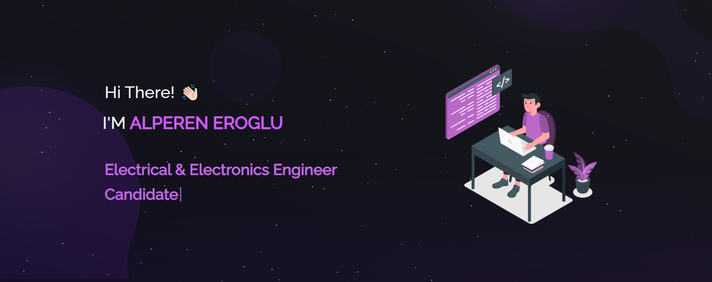

  <h1>My Portfolio WebSite for Github Pages and Heroku</h1>
  

 

 &nbsp;
 &nbsp;
 &nbsp;
 &nbsp;
 &nbsp;

## My Github Page

You can visit my github page <a href="https://aeroglumu.github.io/My-Portfolio-WebSite/" target="_blank">from here</a>.

## My Heroku Portfolio

You can also visit my heroku portfolio <a href="https://alpereneroglu.herokuapp.com" target="_blank">from here</a>.

## Built With

This project was built using these technologies.

- React.js
- Node.js
- Atom

## Features

**📖 Multi-Page Layout**

**🎨 Styled with React-Bootstrap and Css with easy to customize colors**

**📱 Fully Responsive**

## Getting Started

Clone down this repository. You will need `node.js` and `git` installed globally on your machine.

## 🛠 Installation and Setup Instructions

1. Installation: `npm install`

2. In the project directory, you can run: `npm start`

Runs the app in the development mode.\
Open [http://localhost:3000](http://localhost:3000) to view it in the browser.
The page will reload if you make edits.

## Usage Instructions

Open the project folder and Navigate to `/src/components/`.  
You will find all the components used and you can edit your information accordingly.

### Developer

The main design of this portfolio site was done by <a href="http://soumya-jit.tech/" target="_blank">soumyajit4419</a>. If you want such a portfolio site, you can visit <a href="http://soumya-jit.tech/" target="_blank">soumyajit4419</a>'s page.
